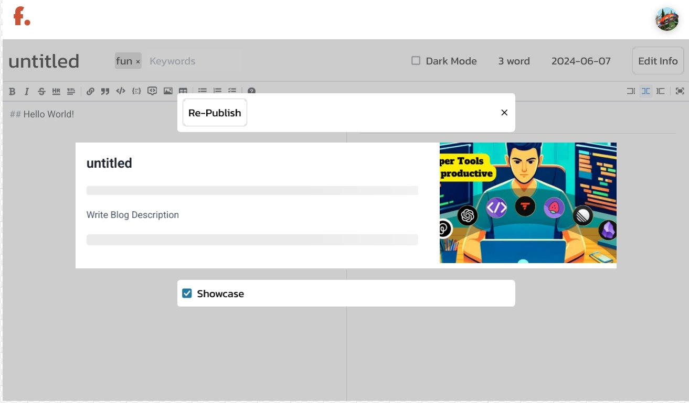
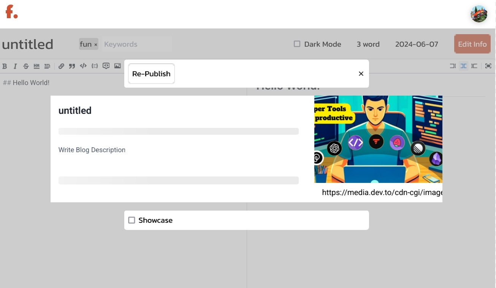

# f. Blog

f. Blog is a full-featured blog site built using React, Tailwind CSS, Styled Components, Firestore, and Firebase Authentication. This project aims to provide users with a seamless and intuitive platform for creating, sharing, and exploring blog content.

## Functionalities

- **Dashboard**: A centralized hub for managing blog content, user interactions, and settings.
- **Insights**: Access analytics and insights into blog performance, user engagement, and traffic.
- **Views & Likes**: Track the number of views and likes on each blog post.
- **Follow**: Allow users to follow their favorite bloggers and receive updates on new posts.
- **Search**: Enable users to search for specific blog posts based on keywords, categories, or tags.
- **View Blog**: Display blog posts with a clean and responsive layout optimized for readability.
- **Create Blog**: Intuitive interface for composing and publishing new blog posts.
- **Edit Blog**: Update and refine existing blog posts with ease.
- **Skeleton Loading**: Enhance user experience with skeleton loading animations for smoother content loading.
- **Login & Signup**: Secure authentication system using Firebase Authentication for user login and signup.
- **Settings**: Personalize user experience with customizable settings, including profile information and preferences.
- **Change Email & Password**: Allow users to update their email address and password securely.
- **Add Social Media Links**: Integrate social media profiles to connect with readers and expand reach.
- **Delete Account**: Provide users with the option to delete their account and associated data.
- **View Users**: Explore other users' profiles and discover new content creators.

## Technologies Used

- **React**: Frontend framework for building dynamic and interactive user interfaces.
- **Tailwind CSS**: Utility-first CSS framework for rapid UI development and customization.
- **Styled Components**: CSS-in-JS library for styling React components with scoped styles.
- **Firestore**: NoSQL cloud database for storing and managing blog data in real-time.
- **Firebase Authentication**: Secure authentication service for user authentication and authorization.

## Screenshots

## Getting Started

To run the project locally, follow these steps:

1. Clone the repository: `git clone <repository_url>`
2. Navigate to the project directory: `cd f-blog`
3. Install dependencies: `npm install`
4. Set up Firebase project and configure Firebase Authentication and Firestore.
5. Create a `.env` file and add Firebase configuration variables.
6. Start the development server: `npm start`

## License

This project is licensed under the [MIT License](LICENSE).

## Acknowledgements

- Special thanks to the creators of creators of Typesense!!
